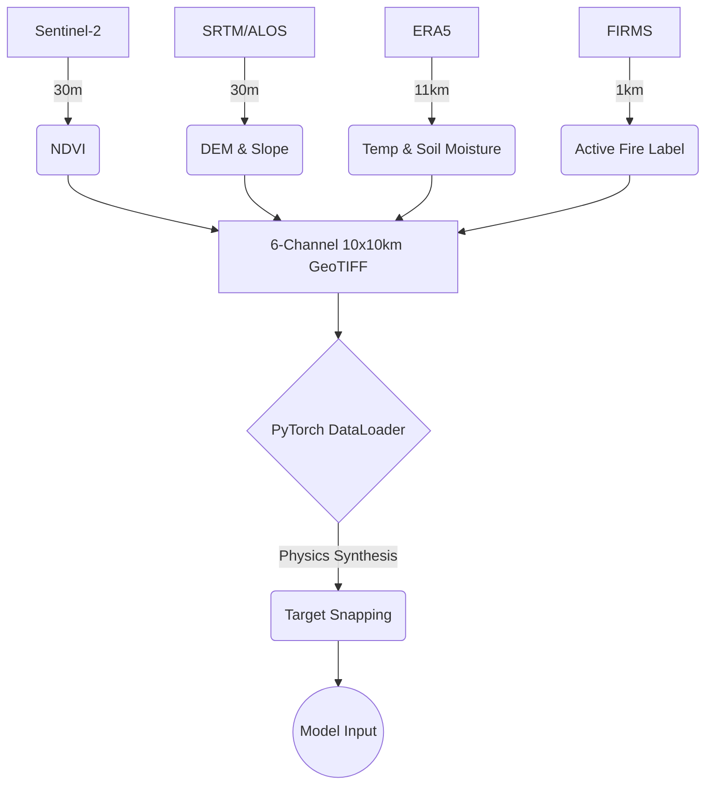
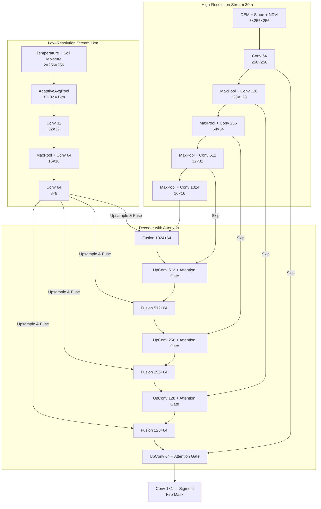
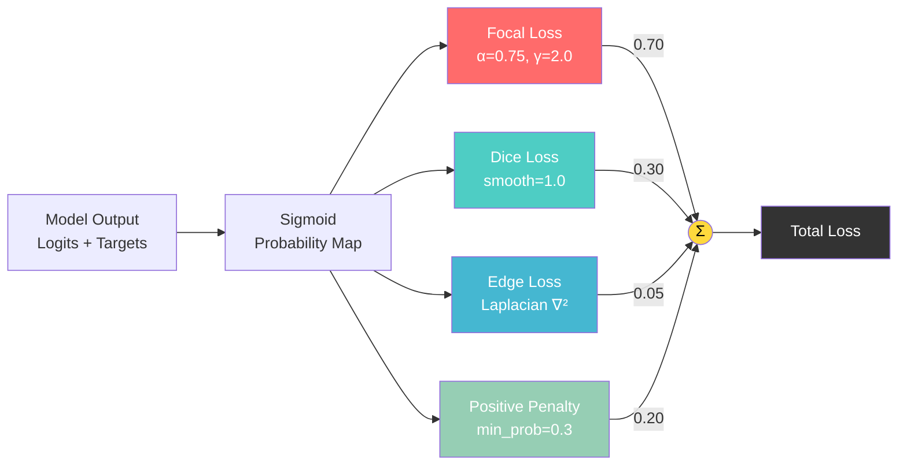
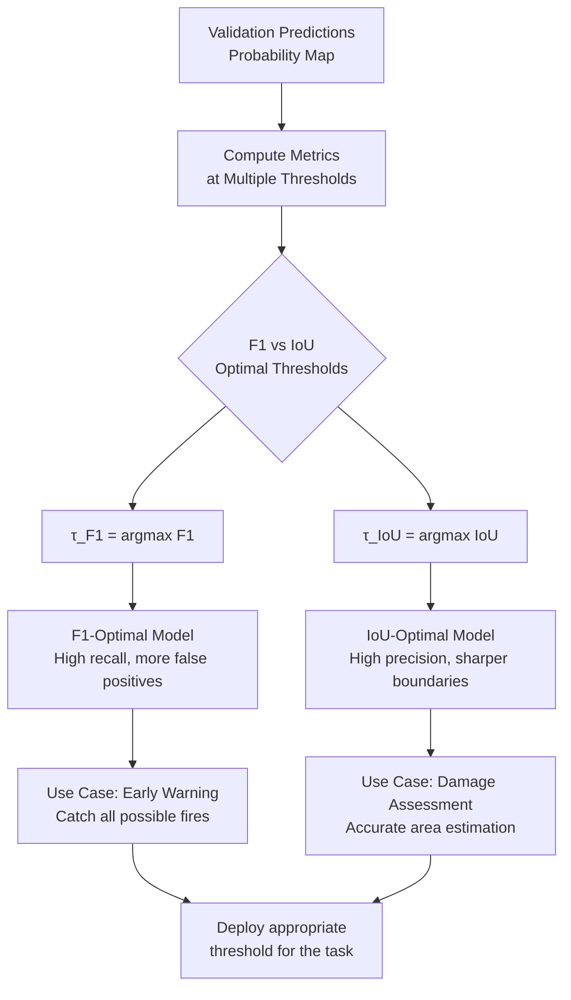

# 🔥 Forest Fire Prediction- FireUNET
## ISRO Bhartiya Antariksh Hackathon

---

## 📋 Table of Contents
- [Problem Statement](#-problem-statement)
- [Data Pipeline & Synthesis](#-data-pipeline--synthesis)
- [Model Architecture](#-model-architecture)
- [Loss Functions](#-loss-functions)
- [Training Strategy](#-training-strategy)
- [Results & Visualizations](#-results--visualizations)

---

## 🎯 Problem Statement
Active forest fire detection at **30-meter spatial resolution** using multi-modal satellite data faces a critical challenge: **extreme resolution mismatches** between input modalities. objective was to develop a deep learning model that can:
1. Detect active fire boundaries at 30m resolution.
2. Fuse coarse climate data (11km ERA5) with high-resolution satellite imagery (30m Sentinel-2).
3. Produce sharp, non-bleeding fire perimeters.
4. Generalize across diverse global landscapes.

### The Resolution Mismatch Challenge
| Modality | Native Resolution | Data Type | Constraint |
| :--- | :--- | :--- | :--- |
| **Sentinel-2** | 30m | NDVI | High-res vegetation |
| **SRTM / ALOS** | 30m | DEM & Slope | High-res terrain |
| **FIRMS** | 1km (1000m) | Active Fire Label | **Blocky, coarse targets** |
| **ERA5** | 11km (11000m) | Temp & Moisture | **Featureless regional data** |

**Key Insight:** Traditional approaches that simply upsample coarse data fail. ERA5 temperature (11km) appears as a flat, featureless block across a 10km patch. FIRMS labels (1km) produce 90-degree Minecraft-like fire boundaries. The model cannot learn fine-grained boundaries from raw coarse supervision.

---

## 📊 Data Pipeline & Synthesis

To overcome the resolution mismatch, we engineered a custom PyTorch `DataLoader` that physically synthesizes and refines the data prior to training.

---

# 🧠 Model Architecture

### Multi-Scale Fusion U-Net with Attention

Our architecture extends the standard U-Net with two key innovations:

#### 1. Dual-Stream Encoder
- **High-Resolution Stream:** Processes DEM, Slope, NDVI at native 30m resolution
- **Low-Resolution Stream:** Processes ERA5 climate data at ~1km scale using adaptive pooling
- **Fusion Points:** Low-res features upsampled and concatenated at 4 decoder levels

#### 2. Attention-Gated Skip Connections
Traditional U-Nets concatenate encoder features directly. We use attention gates that learn to focus on relevant spatial regions:

### Model Specifications

| Component | Details |
|-----------|---------|
| High-Res Encoder | 5 levels: 64→128→256→512→1024 |
| Low-Res Encoder | 3 levels: 32→64→64 |
| Decoder | 4 levels with transposed convolutions |
| Attention Gates | 4 gates (one per decoder level) |
| Total Parameters | ~7.8M |
| Input Size | 256×256 pixels (7.68km²) |

# 📉Loss Functions

# 🎯 Dynamic Threshold Optimization

### Training Configuration
| Parameter | Value |
|-----------|-------|
| Batch Size | 8 |
| Epochs | 100 (with early stopping) |
| Optimizer | AdamW |
| Initial LR | 1e-4 |
| LR Schedule | Warmup (10 epochs) + Cosine Annealing |
| Weight Decay | 1e-5 |
| Gradient Clipping | 1.0 |
| Train/Val Split | 80/20 |

# Fire Detection Visualizations

<!-- Add prediction visualizations here -->

Figure: Model predictions showing input channels, ground truth, and predicted fire masks
